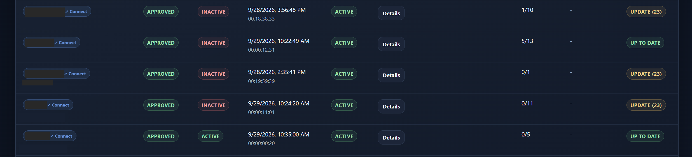
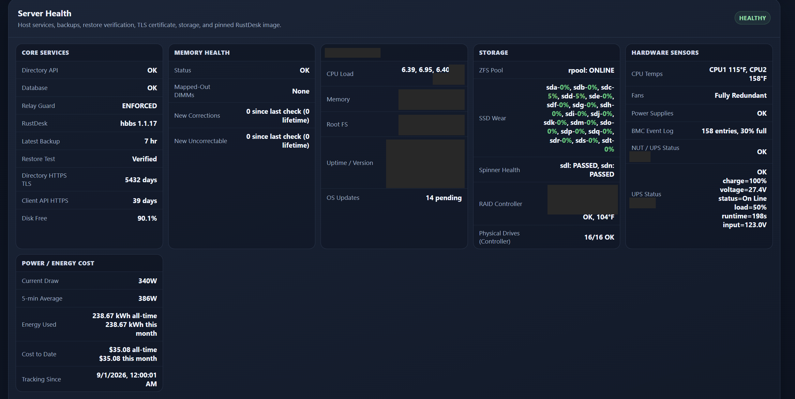
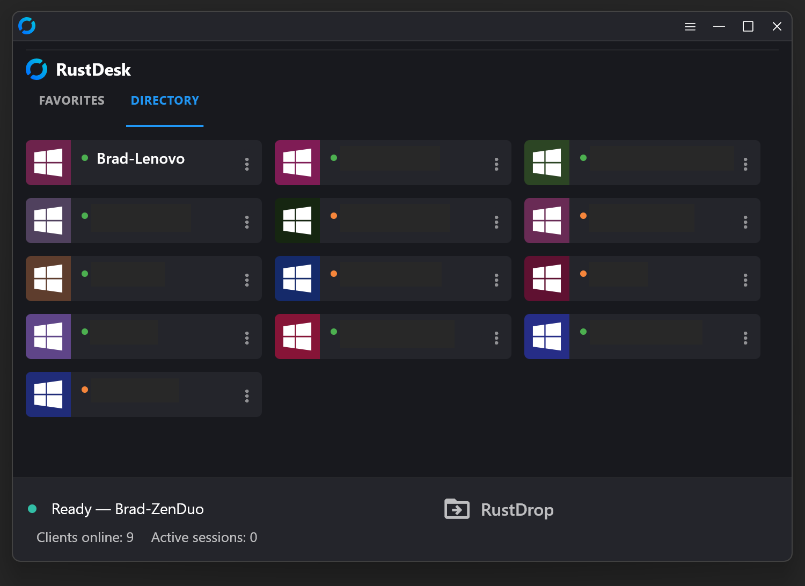
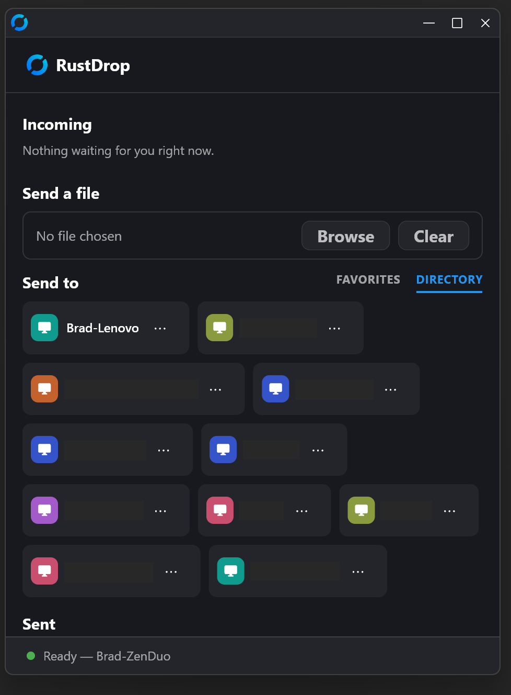
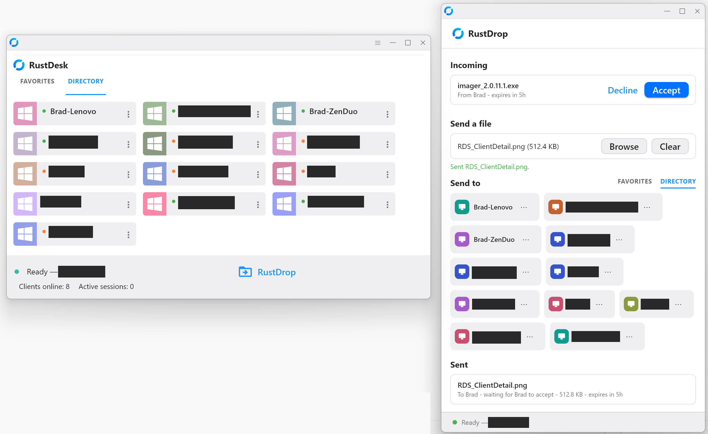

> Yes, I used Claude to act as SSoE for me. It caught quite a few things that I just missed.
>
> **Credits & attribution**
> - This repository is a fork of
>   [rustdesk/rustdesk-server](https://github.com/rustdesk/rustdesk-server) (AGPL-3.0), the official
>   self-hosted RustDesk rendezvous/relay server. Apart from `directory-api/` and the "What
>   `directory-api/` adds" section of this README, the repository is unmodified upstream source —
>   full credit to the RustDesk team and its contributors.
> - In production this is actually run via the community-maintained security-hardened build published
>   at [rustdesk-org/rustdesk-server](https://github.com/rustdesk-org/rustdesk-server) rather than a
>   self-built image; credit to that project and its maintainer(s) as well.
> - This fork adds [`directory-api/`](directory-api/) — a self-hosted Client directory, Client
>   Manager enrollment/2FA, audit logging, relay-access leasing, and admin management API that sits
>   in front of the server above. See [`directory-api/README.md`](directory-api/README.md) for
>   setup/layout details.

## What `directory-api/` adds ("RDS")

RDS is the management layer this fork adds in front of a stock hbbs/hbbr — it doesn't touch the
relay/rendezvous protocol at all, it just makes running a *fleet* of RustDesk Clients practical
instead of a pile of individually-configured machines. It pairs with
[rustdesk-managed-client](https://github.com/MAGA-Brad/rustdesk-managed-client) ("RDC"), a fork of
the RustDesk client built to talk to it, and with
[rustdrop-storage](https://github.com/MAGA-Brad/rustdrop-storage) ("RD"), the internal blob store
that holds RustDrop's encrypted files (RDS authorizes every transfer and is RD's only caller).

### Fleet enrollment and lifecycle
- **Self-service, password-gated enrollment** — a Client authenticates with a shared enrollment
  secret (owner-managed, with optional expiry and use limits) and registers itself as **pending**;
  it gets no device credential, directory access or relay lease until a Client Manager approves it.
- **Full Client lifecycle**: a pending Client is **approved** or **denied**. An approved Client can
  be **blocked** (reversible: an owner authorizes it to re-enroll and it comes back through
  approval) or **revoked** (permanent; it needs a fresh install). Denied Clients can be recovered
  the same way, and an owner can delete blocked/revoked records, with a snapshot kept in the audit
  log. Every change is attributed to a Client Manager and logged.
- **Owner-authorized re-enrollment recovery** — a Client that loses or regenerates its local
  credential isn't orphaned: an owner can issue a short-lived authorization letting it re-enroll
  under its original identity. Its old credential and relay leases are revoked on the spot, and it
  returns to **pending** for a fresh approval.
- **Friendly-name reservation** — human-readable Client names are reserved while a Client is
  pending/approved/blocked and automatically released when denied/revoked, so names don't get
  permanently squatted by dead entries.

### Client Manager accounts, not shared passwords
- Client Manager accounts with three roles (owner, manager, viewer) — sensitive actions (like
  authorizing a re-enrollment) require the **owner** role specifically, not just "logged in."
- **TOTP two-factor authentication** is set up for every Client Manager account when it's created
  (invitation, bootstrap, or promotion to owner) and asked for at sign-in.
- **Audit logging**: every enrollment attempt, Client status change, sign-in, and Client Manager
  account action is recorded with the acting Client Manager and source IP, in an append-only table
  (database triggers block edits and deletes) — a real audit trail, not just current state.

### Relay access is leased, not just allowed
- Clients get **short-lived, per-Client relay-access leases** (10 minutes, renewed automatically)
  tied to their device credential, and a **Relay Guard** daemon syncs active leases into an
  nftables allowlist every couple of seconds. The allowlist gates the NAT-test and direct
  WebSocket ports; the main rendezvous (21116) and relay (21117) ports are deliberately left open
  and rely on RustDesk's own protocol-level authentication, because per-IP gating broke Clients
  behind carrier-grade NAT.

### Signed updates for the managed client
- RDS is also the **signing authority** for RDC's auto-update feature — release manifests are
  Ed25519-signed here before publishing, so the client only ever trusts an update it can verify
  came from this server's private key, not just "whatever file is at this URL." The signed
  manifest also pins the installer's size and SHA-256, and there is one manifest per architecture
  (x86_64 and aarch64).
- Clients poll for a newer signed build every 30 minutes and install it automatically, without a
  prompt, as soon as no remote session is active — publishing a manifest here is what rolls a
  release out to the fleet.

### Ops automation included
- `deploy/sbin/` + `deploy/systemd/` ship real operational scripts, not just app code: automated
  daily backups plus a weekly restore test into an isolated database, the Relay Guard sync daemon,
  a health collector, the signed update-bundle publisher, and an owner emergency-recovery script —
  plus a reference Caddy config that splits the public rendezvous domain, the admin/ops domain, the
  managed-client API domain, and a dedicated large-transfer domain for RustDrop into four
  separately-scoped vhosts, with strict SNI/Host matching.

### Server health monitoring, not just uptime
- A live **Server Health** dashboard panel covering core services (API/DB/relay), host vitals
  (CPU load, memory, root filesystem, uptime, pending OS updates), storage (ZFS pool health,
  per-drive SSD wear %, SMART pass/fail, RAID controller and physical-drive status), and hardware
  sensors (CPU temperature, fan and power-supply redundancy, BMC event log, UPS/NUT status) — down
  to two independent UPS units shown side by side: the one that actually drives the host's shutdown
  and the one that's only monitored for visibility. The host, storage, sensor and UPS readings come
  from small watcher scripts on the hypervisor (not part of this repo); RDS stores and displays
  them. The panel is owner-only.
- A **state-change alert pipeline**: a condition notifies when it goes bad and again when it
  clears, never on every poll, so a sustained failure doesn't become an alert flood. Server,
  storage and hardware problems roll up into a server-health alert checked every minute, alongside
  backup, restore-test and RustDrop-storage alerts — delivered by push to Client Managers using the
  mobile app and by email to the primary owner.

### A companion mobile app, deliberately narrow in scope
- **RDC Mobile Manager** lets a Client Manager view managed Clients, approve/block/revoke them, and
  receive push notifications for new pending Clients and health alerts — from a phone, with 2FA
  login carried over from the web session model. It's intentionally scoped to Client
  management only: no Client Manager account administration (invites, resets, role changes) is
  reachable from the app, since those are account-recovery-capable actions that shouldn't be
  exposed from a phone that could be lost or compromised.

### Remote debug-log requests and build tracking
- The primary owner can flag a single Client or the whole fleet to upload a fresh debug log on its
  next check-in, without needing a remote session into the machine first (chat content is
  scrubbed server-side). Clients also upload their new log lines on their own every hour.
- Client Management tracks each Client's self-reported build number against the latest signed
  release for its architecture, so an out-of-date Client is visible directly in the dashboard
  rather than discovered the hard way.

### Managed 1:1 chat
- A lightweight 1:1 text channel between two managed Clients (for example a Client Manager's own
  RDC and the machine they're about to support), using the same device-credential model as
  everything else here. The server holds a message only until it's delivered (30-day cap); the
  history lives on each Client. Useful for a quick "starting your remote session now" without a
  separate side channel.

See [`directory-api/README.md`](directory-api/README.md) for the actual layout and first-time
setup steps.

## Screenshots

| | |
|---|---|
|  |  |
|  |  |
|  |  |
|  | |

# RustDesk Server Program

[](https://github.com/rustdesk/rustdesk-server/actions/workflows/build.yaml)

[**Download**](https://github.com/rustdesk/rustdesk-server/releases)

[**Manual**](https://rustdesk.com/docs/en/self-host/)

[**Configuration & environment variables**](docs/environment-variables.md)

[**FAQ**](https://github.com/rustdesk/rustdesk/wiki/FAQ)

[**How to migrate OSS to Pro**](https://rustdesk.com/docs/en/self-host/rustdesk-server-pro/installscript/#convert-from-open-source)

Self-host your own RustDesk server, it is free and open source.

> [!IMPORTANT]
> **Need more features?** [RustDesk Server Pro](https://rustdesk.com/pricing.html) might suit you better.
>
> **Want to develop your own server?** Start with [rustdesk-server-demo](https://github.com/rustdesk/rustdesk-server-demo), a simpler starting point than this repository.

## How to build manually

```bash
cargo build --release
```

Three executables will be generated in target/release.

- hbbs - RustDesk ID/Rendezvous server
- hbbr - RustDesk relay server
- rustdesk-utils - RustDesk CLI utilities

You can find updated binaries on the [Releases](https://github.com/rustdesk/rustdesk-server/releases) page.

## Configuration

`hbbs` and `hbbr` can be configured with command-line flags, environment
variables, or an `.env` / config file. Run `hbbs --help` or `hbbr --help` to see
the available flags.

The most common options:

| Option | Flag | Env var | Applies to | Purpose |
| --- | --- | --- | --- | --- |
| Key | `-k` | `KEY` | hbbs, hbbr | `hbbs` loads/generates one by default |
| Bind address | `-b` | `BIND` | hbbs, hbbr | Local IP address to listen on (default: all interfaces; requires 1.1.17+) |
| Port | `-p` | `PORT` | hbbs, hbbr | Listening port (hbbs `21116`, hbbr `21117`) |
| Relay servers | `-r` | `RELAY-SERVERS` | hbbs | Override when the relay uses a different address or a non-standard port |
| Force relay | — | `ALWAYS_USE_RELAY` | hbbs | `Y` disables direct connections |
| Log level | — | `RUST_LOG` | hbbs, hbbr | e.g. `debug` (default `info`) |

See **[docs/environment-variables.md](docs/environment-variables.md)** for the
full list of variables, the file/flag/env precedence rules, database and relay
bandwidth tuning, Docker image variables, and examples.

## Installation

Please follow this [doc](https://rustdesk.com/docs/en/self-host/rustdesk-server-oss/)
