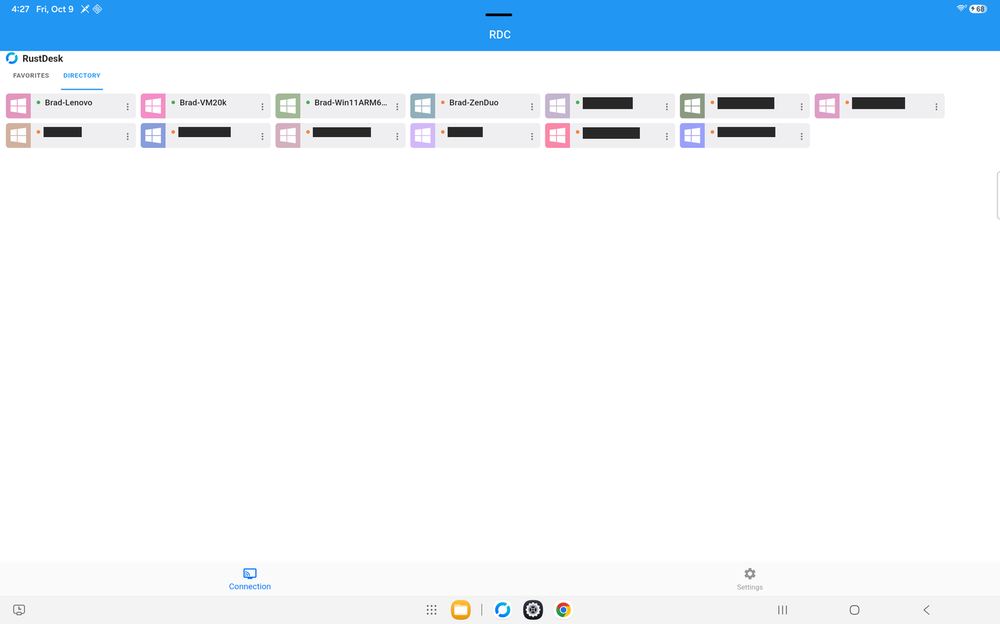

> Yes, I used Claude to act as SSoE for me. It caught quite a few things that I just missed.
>
> **Credits & attribution**
> - This repository is a fork of
>   [rustdesk/rustdesk-server](https://github.com/rustdesk/rustdesk-server) (AGPL-3.0), the official
>   self-hosted RustDesk rendezvous/relay server. Apart from `directory-api/` and the "What
>   `directory-api/` adds" section of this README, the repository is unmodified upstream source —
>   full credit to the RustDesk team and its contributors.
> - In production this is actually run via the community-maintained security-hardened build published
>   at [rustdesk-org/rustdesk-server](https://github.com/rustdesk-org/rustdesk-server) rather than a
>   self-built image, with a few additional hardening patches on top (message-size caps before a
>   peer authenticates or pairs, loopback-only WebSocket listeners behind the TLS proxy, an optional
>   approved-device gate, a signed key exchange on rendezvous connections over TCP and WebSocket,
>   online status for approved devices on those connections, a device-passport check, and WebRTC
>   signaling);
>   credit to that project and its maintainer(s) as well. Those
>   relay patches are published in
>   [rustdesk-managed-relay](https://github.com/MAGA-Brad/rustdesk-managed-relay).
> - This fork adds [`directory-api/`](directory-api/) — a self-hosted Client directory, Client
>   Manager enrollment/2FA, audit logging, relay-access leasing, and admin management API that sits
>   in front of the server above. See [`directory-api/README.md`](directory-api/README.md) for
>   setup/layout details.

## What `directory-api/` adds ("RDS")

RDS is the management layer this fork adds alongside hbbs/hbbr. RustDesk's remote-session protocol
is unchanged apart from one optional login field that carries the device-certificate proof, which
stock clients ignore. RDS makes running a *fleet* of RustDesk Clients practical instead of a pile
of individually-configured machines, and makes every Client prove it belongs there. It pairs with
[rustdesk-managed-client](https://github.com/MAGA-Brad/rustdesk-managed-client) ("RDC"), a fork of
the RustDesk client built to talk to it, and with
[rustdrop-storage](https://github.com/MAGA-Brad/rustdrop-storage) ("RD"), the internal blob store
that holds RustDrop's encrypted files (RDS authorizes every transfer and is RD's only caller).

### Fleet enrollment and lifecycle
- **Self-service, password-gated enrollment** — a Client authenticates with a shared enrollment
  secret (owner-managed, with optional expiry and use limits) and registers itself as **pending**;
  it gets no device credential, directory access or relay lease until a Client Manager approves it.
- **Full Client lifecycle**: a pending Client is **approved** or **denied**. An approved Client can
  be **blocked** (reversible: an owner authorizes it to re-enroll and it comes back through
  approval) or **revoked** (permanent; it needs a fresh install). Denied Clients can be recovered
  the same way, and an owner can delete blocked/revoked records, with a snapshot kept in the audit
  log. Every change is attributed to a Client Manager and logged.
- **Owner-authorized re-enrollment recovery** — a Client that loses or regenerates its local
  credential isn't orphaned: an owner can issue a short-lived authorization letting it re-enroll
  under its original identity. Its old credential and relay leases are revoked on the spot, and it
  returns to **pending** for a fresh approval.
- **Friendly-name reservation** — human-readable Client names are reserved while a Client is
  pending/approved/blocked and automatically released when denied/revoked, so names don't get
  permanently squatted by dead entries.
- **Windows and Android Clients** — RDC for Android enrolls the same way. RDS records each
  Client's platform from its heartbeat (migration `046_device_platform.sql`), marks Android
  Clients with a badge, offers no Connect link for them (they only connect out) and refuses to
  start a managed chat with them. A pending Android Client is listed as Windows until its first
  heartbeat after approval.

### Client Manager accounts, not shared passwords
- Client Manager accounts with three roles (owner, manager, viewer) — sensitive actions (like
  authorizing a re-enrollment) require the **owner** role specifically, not just "logged in."
- **TOTP two-factor authentication** is set up for every Client Manager account when it's created
  (invitation, bootstrap, or promotion to owner) and asked for at sign-in.
- **Hardened sign-in**:
  - passwords are bcrypt-hashed (cost 12);
  - TOTP is required at every sign-in, and an access reset that clears the authenticator forces a
    new one to be enrolled through the one-time reset link before any sign-in;
  - five failed attempts lock the account for 15 minutes;
  - web sessions end after a set idle time, enforced server-side: 8 hours by default, adjustable
    from 15 minutes to 24 hours on the Config page (the mobile app keeps its own session);
  - dashboard actions are role-checked on the server (viewers can't approve, block or revoke).

  When RDS sits behind a CDN, it trusts a forwarded client address only from the CDN's published
  ranges, so per-client rate limits and the audit trail see real client addresses.
- **Audit logging**: every enrollment attempt, Client status change, sign-in, and Client Manager
  account action is recorded with the acting Client Manager and source IP, in an append-only table
  (database triggers block edits and deletes) — a real audit trail, not just current state.

### Device certificates: approved Clients only, on every connection
- **What a certificate is.** RDS is a small **Ed25519 certificate authority** for the fleet. Each
  approved Client fetches a short-lived certificate binding its RustDesk ID to its device public key.
  - Lifetime: 96 hours by default, renewed once it's 24 hours old; both are configurable.
  - Only approved Clients can obtain one (`POST /v1/device/peer-cert`).
  - The CA public key is published at `GET /v1/peer-auth/ca` and compiled into the client.
- **What it's used for.** On every login between two Windows managed Clients (or from RDC for Android
  as the controller), the connecting Client
  presents its certificate plus a signature bound to the receiving side's login challenge, both IDs
  and the session. The receiving Client verifies them and cross-checks the directory RDS sent it:
  a listed caller's certificate key must be its current device key, and while that directory copy
  is under 10 minutes old an unlisted caller counts as not approved. A blocked or revoked Client
  therefore stops passing within about 10 minutes, and at the latest when its certificate expires,
  because RDS won't renew it.
- **The mode.** **off / log / enforce**, chosen on the Config page and delivered to every Client
  with the directory. Log mode records what *would* be refused, so a fleet can be rolled forward
  safely before switching to enforce.
- **Readiness view.** The Config page shows how many approved Clients active in the last 14 days
  report build 28 or newer (the first build that presents certificates), so you know when enforcing
  is safe.

### Device passports, signed by a separate CA VM
- **The split.** RDS doesn't hold the passport CA's keys. A small signer on its own VM
  ([`directory-api/ca/signer`](directory-api/ca/signer)) pulls jobs from RDS's `ca-link` container
  over mutual TLS (`GET /ca/v1/jobs`, `POST /ca/v1/results`, `POST /ca/v1/heartbeat` in
  `app/ca_link.py`); RDS never connects to it. While issuing is on, RDS queues an **issue** job
  when a Client is approved and a **revoke** job when one is blocked or revoked; Clients send
  **renew** and **key update** jobs; RDS stores what comes back (migration
  `045_device_passports.sql`). Clients approved before issuing was turned on are queued with the
  CA panel's **Queue passports for approved devices without one** button.
- **The signer's own rules.** It keeps its own device table and an append-only, hash-chained
  issuance log. Renewals must be signed by the identity key it has on file and key updates by both
  the old and the new key (protected by DPAPI, a TPM or the Android Keystore); revocations are
  always honoured; lifetimes are capped (7 days by
  default) and issuance is rate limited per device. A new identity key is mailed to the owner, and
  a daily digest summarizes what it signed. The root key is stored as an encrypted systemd
  credential and read only to certify a new issuing key, which is generated in memory at start and
  every 30 days by default, and never written to disk. `ca-signer root-pubkey` reads the root seed
  on stdin (for example the decrypted credential piped in) and prints the root public key for
  client builds (`RUSTDESK_MANAGED_PASSPORT_ROOTS`) and hbbs (`PASSPORT_ROOTS`).
- **What a Client does with it.** `GET /v1/device/passport` returns the current passport and the
  identity key on file; `POST /v1/device/identity-key` moves the record from the RustDesk key to
  the Client's own identity key (signed by both); `POST /v1/device/passport/renew` asks for a fresh
  one. Clients renew at half-life.
- **RDS decides the key, not the CA.** RDS verifies a key update itself (both signatures, this
  device, at most 10 minutes old) before queuing it, and `ca_link` takes a CA result only if the
  result and the passport inside it carry the key RDS verified (or the key on file) and name this
  device. Anything else is marked refused and nothing is stored, so the key list hbbs checks
  passports against never comes from the CA alone.
- **Config.** Issuing is off or log; passport lifetime 1 to 7 days (default 1) and the grace period
  for recently expired passports 0 to 30 days (default 7). A CA panel shows the CA VM's last
  heartbeat and job queue.

### Security posture of every Client
- Each Windows Client's hourly device report includes a security section (TPM, Secure Boot and
  UEFI, BitLocker, Windows version and patch level, Defender, firewall profiles and the RustDesk
  rules, the clock's sync source and its offset measured against the configured NTP server, TCP or
  443-fallback path, identity-key protection, passport and certificate expiry, VM or not). RDS
  shows it in a Security section on each Client's page; Client Management adds fleet filters such
  as "clock off by more than 1 minute" and CSV columns.
- RDC for Android sends its own section instead: Android version and patch level, screen lock,
  storage encryption, whether its Keystore key is in secure hardware (TEE) or software, verified boot and
  bootloader lock, developer options and USB/wireless debugging, who installed the app, network
  type, VPN and Private DNS, plus the same passport, certificate and connection-path fields. The
  Windows-only fleet filters skip Android Clients.

### Remote Connections settings and connection stats
- **Settings.** The Config page's **Remote Connections** group (primary owner only) holds:
  - the certificate mode, lifetime and renewal age;
  - the relay-fallback delay Clients use when racing a direct connection against the relay;
  - **rendezvous encryption** for hbbs (off, optional or required), shown next to hbbs's latest
    5-minute counts of encrypted, older-scheme, unencrypted and failed connections, so you can see
    what Required would refuse before switching to it. Managed clients from build 30 require the
    exchange, so RDS refuses to switch it off while any approved Client runs build 30 or newer, and
    the Config page greys Off out. (If Off is already the saved mode, the Remote Connections
    settings can't be saved until encryption is set to optional or required.)
  - **WebRTC direct connections**: off, test devices only (with the list of test RustDesk IDs), or
    on.
  - **Passport check** for hbbs: off, log, test devices only (with their RustDesk IDs), or enforce,
    shown next to hbbs's 5-minute counts of proven, unproven and refused requests. RDS refuses
    Enforce while any approved Client seen in the last 30 days reports a build older than 34, the
    first that proves its passport to hbbs.
- **How hbbs gets them.** `deploy/sbin/rustdesk-approved-ids-sync` runs every minute: it writes the
  encryption, WebRTC and passport settings into hbbs's settings file (hbbs re-reads it within 15
  seconds, no restart), writes the approved IDs and each one's identity-key fingerprint (the list
  hbbs checks passports against), and copies hbbs's counts back into RDS. If RDS's database can't
  be read, it leaves hbbs's settings as they are rather than falling back; an encryption setting
  that was never saved counts as optional. This needs the relay build from
  [rustdesk-managed-relay](https://github.com/MAGA-Brad/rustdesk-managed-relay); stock hbbs ignores
  the file.
- **Reports.** For each remote-desktop or file-transfer session it starts, a managed Client (Windows,
  or RDC for Android)
  reports:
  - the peer's RustDesk ID and the session type;
  - route (relay, WebRTC, or a direct UDP, TCP or IPv6 connection), connect time and the
    relay-fallback delay in effect;
  - session duration and average/maximum round-trip delay.
- **Stats.** RDS shows connect and session-delay statistics by route, so relay-versus-direct
  decisions are based on measured data.

### Sealed transport and TLS-intercepting networks
- **Sealed calls.** Managed Clients encrypt their API calls end to end to RDS's own X25519 key
  (`POST /v1/sealed`, `app/sealed.py`), with a fresh ephemeral key per call, so a CDN or an HTTPS
  filter that terminates TLS sees only ciphertext and can't read, alter, replay or forge a call.
  RDS runs the inner call in-process, so authentication, rate limits and the caller's real IP
  apply exactly as for an unsealed call. A previous key can stay configured to cover a rotation.
- **Intercepting networks.** A Client that meets a certificate it rejects continues only with
  sealed calls and tells RDS who intercepted (the certificate's issuer and subject). RDS looks up
  the network (registry owner and reverse DNS) and approves a network that's clearly a school,
  hospital or government automatically. Calls from a network nobody has reviewed yet are still
  served, since they're sealed. Every new network alerts the owner by email and push
  (auto-approved ones included), and so does a new Client on a known one, at most daily. On the
  **Networks** tab the owner can approve the address or its whole netblock, deny, reset or forget
  it.
- **Per-Client policy.** **Auto** serves everything except denied networks; **Strict** is never
  served through an intercepting network. A refused call gets a sealed "try again later".
  Enrollment calls (made before a Client has a device credential) are always served.
- **With edge certificates required** (`SEALED_REQUIRE_EDGE_CERT=1`), an intercepted call, which
  can't carry the certificate through the interceptor, is served only from an approved network
  (including ones RDS approved automatically) and only for a Client that holds an active edge
  certificate; without a device credential it's refused, just as it would be without the
  interception claim. Enrollment and certificate bootstrap calls stay exempt, as they are on any
  network.
- **No unsealed fallback.** From client build 31, a refused sealed call fails instead of being
  resent without the envelope. Keep sealing configured: if RDS can't open envelopes (no key, or a
  rotated key without the previous one kept), those Clients can't reach RDS until the key they were
  built with is configured again. Update checks are sealed too, so they can't update their way
  out.

### Edge client certificates
- Approved Clients (and the mobile app) get mTLS client certificates for the RDS edge, signed by
  Cloudflare's managed client CA (`app/edge_certs.py`). Devices send a certificate request, so the
  private key never leaves the device; browsers get a one-time, password-protected bundle.
- Blocking or revoking a Client, or replacing its certificate, revokes the old one at Cloudflare
  too, and operators can revoke their own browser and app certificates individually. Requiring the
  certificate at the edge is a separate switch, once every Client has one.

### Change-driven device sync
- Instead of polling the directory, RustDrop and updates on timers, a Client holds a sealed
  `POST /v1/device/wait` open (up to 50 seconds) and gets an answer within about two seconds of a
  change to something it cares about: the directory, the latest build for its architecture, its
  RustDrop activity, a debug-log request, or its approval status (`app/device_sync.py`). Every heartbeat reply carries
  the same version fingerprints, so a blocked wait costs at most one heartbeat interval.

### Relay access is leased, not just allowed
- Clients get **short-lived, per-Client relay-access leases** (10 minutes, renewed automatically)
  tied to their device credential, and a **Relay Guard** daemon syncs active leases into an
  nftables allowlist every couple of seconds. The allowlist gates the NAT-test and direct
  WebSocket ports; the main rendezvous (21116) and relay (21117) ports are deliberately left open
  and rely on RustDesk's own protocol-level authentication, because per-IP gating broke Clients
  behind carrier-grade NAT.

### Signed updates for the managed client
- RDS is also the **signing authority** for RDC's auto-update feature — release manifests are
  Ed25519-signed here before publishing, so the client only ever trusts an update it can verify
  came from this server's private key, not just "whatever file is at this URL." The signed
  manifest also pins the installer's size and SHA-256, and there is one manifest per architecture
  (x86_64 and aarch64).
- RDC for Android has its own architecture key, `android-aarch64` (manifest
  `stable-android-aarch64.json`), where `/v1/updates/latest` accepts only `.apk` releases (every
  other architecture only `.exe`) and downloads are served as Android packages. Android release
  numbers are the managed build × 100 + a revision; Client Management compares the number the app
  reports with its upload against the published one. `rustdesk-publish-bundle` handles the Windows
  architectures only; sign an Android manifest with the same key and payload format.
- Clients learn about a newly published build within seconds through change-driven sync (with a
  30-minute check as a backstop) and install it automatically, without a prompt, as soon as no
  remote session is active — publishing a manifest here is what rolls a release out to the fleet.

### Ops automation included
- `deploy/sbin/` + `deploy/systemd/` ship real operational scripts, not just app code: automated
  daily backups plus a weekly restore test into an isolated database, the Relay Guard sync daemon,
  a health collector, the per-minute sync that feeds hbbs its approved IDs and Remote Connections
  settings, the signed update-bundle publisher, and an owner emergency-recovery script —
  plus a reference Caddy config that splits the public rendezvous domain, the admin/ops domain, the
  managed-client API domain, a dedicated large-transfer domain for RustDrop, and a CDN-fronted
  WebSocket fallback domain (hbbs/hbbr on 443, reachable only through the CDN, with the client
  address passed on from the CDN's header) into five separately-scoped vhosts, with strict SNI/Host
  matching.

### Server health monitoring, not just uptime
- A live **Server Health** dashboard panel covering core services (API/DB/relay), host vitals
  (CPU load, memory, root filesystem, uptime, pending OS updates), storage (ZFS pool health,
  per-drive SSD wear %, SMART pass/fail, RAID controller and physical-drive status), and hardware
  sensors (CPU temperature, fan and power-supply redundancy, BMC event log, UPS/NUT status) — down
  to two independent UPS units shown side by side: the one that actually drives the host's shutdown
  and the one that's only monitored for visibility. The host, storage, sensor and UPS readings come
  from small watcher scripts on the hypervisor (not part of this repo); RDS stores and displays
  them. The panel is owner-only.
- A **state-change alert pipeline**: a condition notifies when it goes bad and again when it
  clears, never on every poll, so a sustained failure doesn't become an alert flood. Server,
  storage and hardware problems roll up into a server-health alert checked every minute, alongside
  backup, restore-test and RustDrop-storage alerts — delivered by push to Client Managers using the
  mobile app and by email to the primary owner.

### A companion mobile app, deliberately narrow in scope
- **RDC Mobile Manager** lets a Client Manager view managed Clients, approve/block/revoke them, and
  receive push notifications for new pending Clients and health alerts — from a phone, with 2FA
  login carried over from the web session model. It's intentionally scoped to Client
  management only: no Client Manager account administration (invites, resets, role changes) is
  reachable from the app, since those are account-recovery-capable actions that shouldn't be
  exposed from a phone that could be lost or compromised.

### Remote debug-log requests and build tracking
- The primary owner can flag a single Client or the whole fleet to upload a fresh debug log on its
  next check-in, without needing a remote session into the machine first (chat content is
  scrubbed server-side). Clients also upload their new log lines on their own every hour.
- Client Management tracks each Client's self-reported build number against the latest signed
  release for its architecture, so an out-of-date Client is visible directly in the dashboard
  rather than discovered the hard way.

### Managed 1:1 chat
- A lightweight 1:1 text channel between two managed Clients (for example a Client Manager's own
  RDC and the machine they're about to support), using the same device-credential model as
  everything else here. The server holds a message only until it's delivered (30-day cap); the
  history lives on each Client. Useful for a quick "starting your remote session now" without a
  separate side channel.

For the complete end-to-end security model (enrollment, device certificates, signed updates,
transport including sealed calls and sealed WebRTC signaling, relay leasing, operator accounts,
what the server can and can't see), see the
[Security model section of the client README](https://github.com/MAGA-Brad/rustdesk-managed-client#security-model).

See [`directory-api/README.md`](directory-api/README.md) for the actual layout and first-time
setup steps.

## Screenshots

| | |
|---|---|
|  |  |
|  |  |
|  |  |
|  |  |

# RustDesk Server Program

[](https://github.com/rustdesk/rustdesk-server/actions/workflows/build.yaml)

[**Download**](https://github.com/rustdesk/rustdesk-server/releases)

[**Manual**](https://rustdesk.com/docs/en/self-host/)

[**Configuration & environment variables**](docs/environment-variables.md)

[**FAQ**](https://github.com/rustdesk/rustdesk/wiki/FAQ)

[**How to migrate OSS to Pro**](https://rustdesk.com/docs/en/self-host/rustdesk-server-pro/installscript/#convert-from-open-source)

Self-host your own RustDesk server, it is free and open source.

> [!IMPORTANT]
> **Need more features?** [RustDesk Server Pro](https://rustdesk.com/pricing.html) might suit you better.
>
> **Want to develop your own server?** Start with [rustdesk-server-demo](https://github.com/rustdesk/rustdesk-server-demo), a simpler starting point than this repository.

## How to build manually

```bash
cargo build --release
```

Three executables will be generated in target/release.

- hbbs - RustDesk ID/Rendezvous server
- hbbr - RustDesk relay server
- rustdesk-utils - RustDesk CLI utilities

You can find updated binaries on the [Releases](https://github.com/rustdesk/rustdesk-server/releases) page.

## Configuration

`hbbs` and `hbbr` can be configured with command-line flags, environment
variables, or an `.env` / config file. Run `hbbs --help` or `hbbr --help` to see
the available flags.

The most common options:

| Option | Flag | Env var | Applies to | Purpose |
| --- | --- | --- | --- | --- |
| Key | `-k` | `KEY` | hbbs, hbbr | `hbbs` loads/generates one by default |
| Bind address | `-b` | `BIND` | hbbs, hbbr | Local IP address to listen on (default: all interfaces; requires 1.1.17+) |
| Port | `-p` | `PORT` | hbbs, hbbr | Listening port (hbbs `21116`, hbbr `21117`) |
| Relay servers | `-r` | `RELAY-SERVERS` | hbbs | Override when the relay uses a different address or a non-standard port |
| Force relay | — | `ALWAYS_USE_RELAY` | hbbs | `Y` disables direct connections |
| Log level | — | `RUST_LOG` | hbbs, hbbr | e.g. `debug` (default `info`) |

See **[docs/environment-variables.md](docs/environment-variables.md)** for the
full list of variables, the file/flag/env precedence rules, database and relay
bandwidth tuning, Docker image variables, and examples.

## Installation

Please follow this [doc](https://rustdesk.com/docs/en/self-host/rustdesk-server-oss/)
